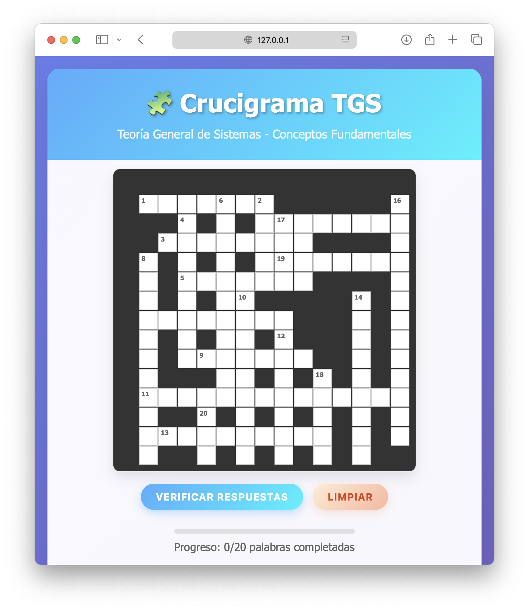

# 🧩 Crucigrama TGS - Teoría General de Sistemas

Un crucigrama interactivo desarrollado en JavaScript vanilla para aprender y repasar conceptos fundamentales de la Teoría General de Sistemas.



## 🌟 Características

- **20 palabras** basadas en conceptos fundamentales de TGS
- **Interfaz moderna y responsiva** con gradientes y animaciones
- **Navegación inteligente** entre celdas con teclado y mouse
- **Verificación automática** de respuestas con feedback visual
- **Barra de progreso** en tiempo real
- **Compatibilidad móvil** y desktop
- **Sin dependencias externas** - JavaScript vanilla puro

## 🎯 Conceptos Incluidos

### Horizontales
1. **SISTEMA** - Conjunto de elementos interrelacionados que persiguen un objetivo común
2. **AMBIENTE** - Todo lo que rodea al sistema y está fuera de sus fronteras
3. **ENERGÍA** - Capacidad para realizar trabajo o generar cambio
4. **ENTROPÍA** - Medida del desorden o falta de información en un sistema
5. **OUTPUT** - Resultado que el sistema exporta a su ambiente
6. **RETROALIMENTACIÓN** - Mecanismo donde la salida regresa como entrada para control
7. **SINERGIA** - Propiedad emergente donde 2+2=5
8. **VIABILIDAD** - Capacidad de mantenerse y adaptarse en el tiempo
9. **CAJA NEGRA** - Enfoque que estudia solo entradas y salidas
10. **EQUILIBRIO** - Estado donde las fuerzas se balancean sin cambio neto

### Verticales
1. **INPUT** - Recursos que el sistema recibe del ambiente
2. **FRONTERA** - Línea que separa el sistema de su ambiente
3. **EMERGENCIA** - Surgimiento de propiedades no presentes en elementos individuales
4. **HOMEOSTASIS** - Capacidad de autorregulación y equilibrio dinámico
5. **ATRIBUTOS** - Características que definen los elementos del sistema
6. **RELACIONES** - Vínculos e interacciones entre elementos del sistema
7. **NEGENTROPÍA** - Tendencia a organizarse y aumentar el orden
8. **PERMEABILIDAD** - Grado de intercambio a través de las fronteras
9. **MODELO** - Representación simplificada de la realidad
10. **ELEMENTOS** - Partes fundamentales que constituyen el sistema

## 🚀 Instalación y Uso

### Opción 1: Descarga Directa
```bash
git clone https://github.com/adriancho91s/crossword-tgs.git
cd crossword-tgs
```

### Opción 2: Usar GitHub Pages
Visita directamente: `https://adriancho91s.github.io/crossword-tgs`

### Estructura del Proyecto
```
crossword-tgs/
├── index.html          # Archivo principal HTML
├── js/
│   └── crossword.js    # Lógica del crucigrama
│   └── screenshot.png  # Captura de pantalla del proyecto
├── css/
│   └── styles.css      # Estilos (opcional si separas el CSS)
└── README.md           # Este archivo
```

## 💻 Tecnologías Utilizadas

- **HTML5** - Estructura semántica
- **CSS3** - Estilos modernos con gradientes y animaciones
- **JavaScript ES6+** - Lógica interactiva sin frameworks
- **Responsive Design** - Compatible con móviles y tablets

## 🎮 Cómo Jugar

1. **Navegación**: Haz clic en cualquier celda blanca o usa las flechas del teclado
2. **Escritura**: Escribe una letra por celda (se convierte automáticamente a mayúscula)
3. **Verificación**: Presiona "Verificar Respuestas" para comprobar tu progreso
4. **Progreso**: Observa la barra de progreso para ver palabras completadas
5. **Reinicio**: Usa "Limpiar" para empezar de nuevo

### Atajos de Teclado
- **Flechas** ←↑→↓: Navegar entre celdas
- **Backspace**: Borrar letra y retroceder
- **Enter/Tab**: Avanzar a la siguiente celda

## 🎨 Características de Diseño

- **Gradientes modernos** con colores vibrantes
- **Animaciones suaves** en hover y focus
- **Feedback visual** para respuestas correctas
- **Diseño glassmorphism** con transparencias
- **Tipografía clara** y legible
- **Iconos emoji** para mejor UX

## 🔧 Personalización

### Cambiar Palabras
Edita el objeto `answers` en `js/crossword.js`:
```javascript
const answers = {
    1: { word: "NUEVAPALABRA", row: 1, col: 1, direction: "across" },
    // ... más palabras
};
```

### Modificar Colores
Actualiza las variables CSS en el archivo de estilos:
```css
--primary-gradient: linear-gradient(135deg, #667eea 0%, #764ba2 100%);
--accent-color: #4facfe;
```

### Cambiar Tamaño de Grilla
Modifica las constantes en `crossword.js`:
```javascript
const GRID_SIZE = 15; // Cambiar a tu tamaño preferido
```

## 📱 Responsividad

El crucigrama está optimizado para:
- **Desktop**: Experiencia completa con hover effects
- **Tablet**: Navegación táctil mejorada
- **Móvil**: Diseño adaptativo y controles optimizados

## 🤝 Contribuciones

¡Las contribuciones son bienvenidas! Para contribuir:

1. Fork el proyecto
2. Crea una rama para tu feature (`git checkout -b feature/AmazingFeature`)
3. Commit tus cambios (`git commit -m 'Add some AmazingFeature'`)
4. Push a la rama (`git push origin feature/AmazingFeature`)
5. Abre un Pull Request

### Ideas para Contribuir
- Agregar más palabras y conceptos
- Implementar sistema de hints
- Añadir temporizador
- Crear diferentes niveles de dificultad
- Agregar sonidos y efectos
- Implementar modo oscuro

## 🐛 Reportar Problemas

¿Encontraste un bug? [Crea un issue](https://github.com/adriancho91s/crossword-tgs/issues) con:
- Descripción del problema
- Pasos para reproducirlo
- Navegador y versión
- Capturas de pantalla si es posible

## 📄 Licencia

Este proyecto está bajo la Licencia MIT - ver el archivo [LICENSE](LICENSE) para más detalles.

## 👨‍💻 Autor

**Adrián Gaitán**
- GitHub: [@adriancho91s](https://github.com/adriancho91s)
- LinkedIn: [Adrián F. Gaitán](https://linkedin.com/in/adriancho91s)
- Instagram: [@adriancho91s](https://instagram.com/adriancho91s)
